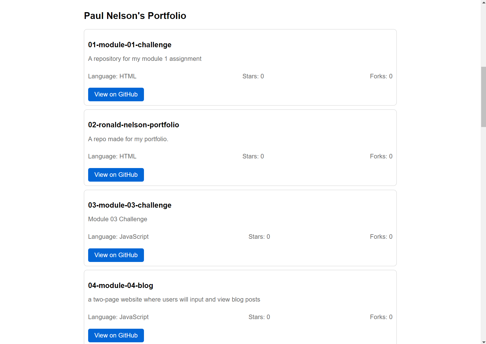

# React Portfolio

## Description

**Deployed Link** https://pauleerama93.netlify.app/

Being a web developer means being part of a community. You’ll need a place to share your projects not only if you're applying for jobs or working as a freelancer but also so that you can share your work with fellow developers and collaborate on future projects.

This project is a portfolio website built using React, designed to help set you apart from other developers by showcasing your work with the latest technologies. The application is a single-page portfolio that demonstrates your skills, projects, and contact information, and is deployed on Netlify.


## Table of Contents
- [Description](#description)
- [User Story](#user-story)
- [Acceptance Criteria](#acceptance-criteria)
- [Installation](#installation)
- [Usage](#usage)
- [Deployment](#deployment)
- [Screenshots](#screenshots)
- [Credits](#credits)
- [License](#license)

## User Story

As an employer looking for candidates with experience building single-page applications,  
I want to view a potential employee's deployed React portfolio of work samples  
So that I can assess whether they're a good candidate for an open position.

## Acceptance Criteria

- **Given** a single-page application portfolio for a web developer
  - **When** I load the portfolio
    - **Then** I am presented with a page containing a header, a section for content, and a footer.
  - **When** I view the header
    - **Then** I am presented with the developer's name and navigation with titles corresponding to different sections of the portfolio.
  - **When** I view the navigation titles
    - **Then** I am presented with the titles About Me, Portfolio, Contact, and Resume, and the title corresponding to the current section is highlighted.
  - **When** I click on a navigation title
    - **Then** I am presented with the corresponding section below the navigation without the page reloading and that title is highlighted.
  - **When** I load the portfolio the first time
    - **Then** the About Me title and section are selected by default.
  - **When** I am presented with the About Me section
    - **Then** I see a recent photo or avatar of the developer and a short bio about them.
  - **When** I am presented with the Portfolio section
    - **Then** I see titled images of six of the developer’s applications with links to both the deployed applications and the corresponding GitHub repository.
  - **When** I am presented with the Contact section
    - **Then** I see a contact form with fields for a name, an email address, and a message.
  - **When** I move my cursor out of one of the form fields without entering text
    - **Then** I receive a notification that this field is required.
  - **When** I enter text into the email address field
    - **Then** I receive a notification if I have entered an invalid email address.
  - **When** I am presented with the Resume section
    - **Then** I see a link to a downloadable resume and a list of the developer’s proficiencies.
  - **When** I view the footer
    - **Then** I am presented with text or icon links to the developer’s GitHub and LinkedIn profiles, and their profile on another platform.

## Installation

1. Clone the repository:
   ```sh
   git clone https://github.com/your-username/react-portfolio.git

2. Navigate to the project directory:
    ```sh
    cd react-portfolio
3. Install the dependencies:
    ```sh
    npm install

## Usage
1. Start the development server:
    ```sh
    npm start
2. Open your browser and navigate to http://localhost:3000 to view the portfolio.

## Deployment
This project is deployed on Netlify. Follow these steps to deploy your own version:

1. Create a production build:
    ```sh
    npm run build
2. Follow the instructions here:https://vitejs.dev/guide/static-deploy.html#netlify-with-git to deploy the build to Netlify. 

## Screenshots
 - Home Page

 - About

 - Portfolio

 - Resume 
## Credits
Special thanks to my teachers, Drew and Kyle, for their guidance and support in teaching me the right methods to complete this module. Drew's speed runs were particularly helpful.

## License
This project is licensed under the MIT License. See the LICENSE file for details.


